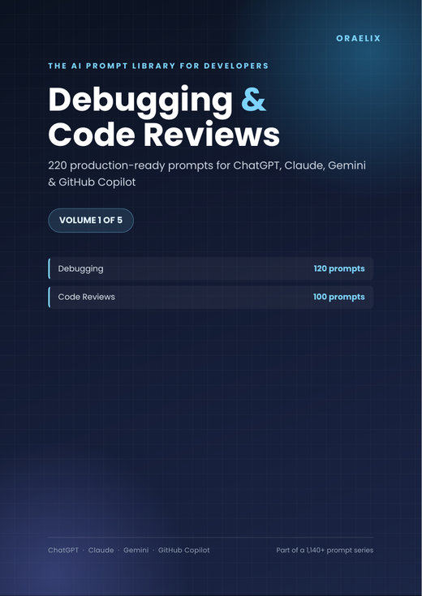
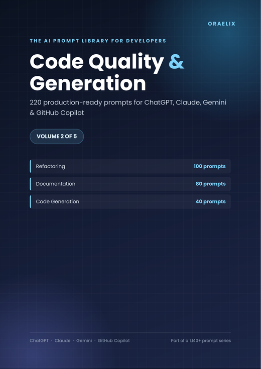
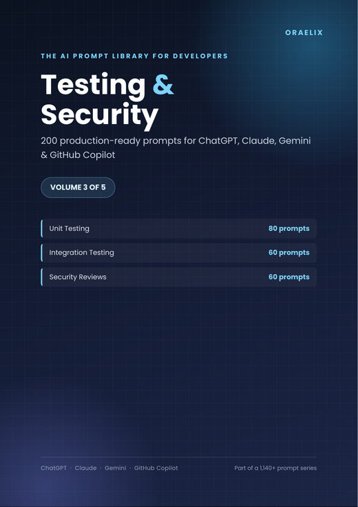
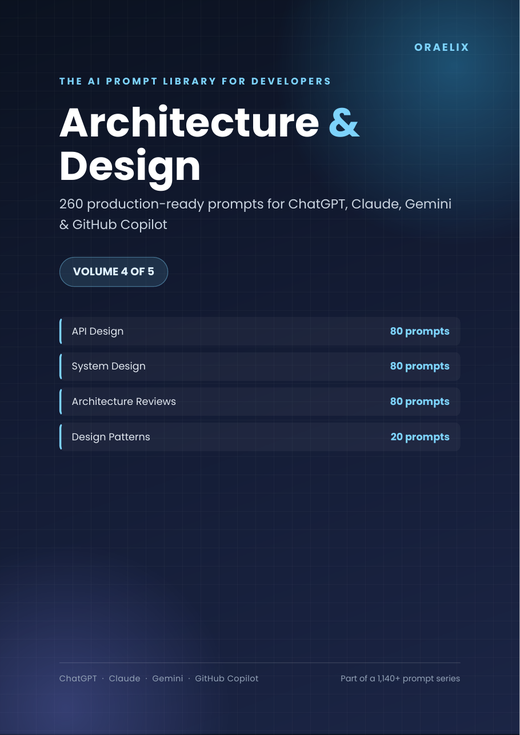
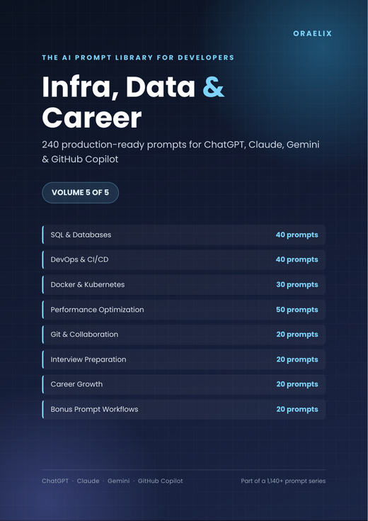
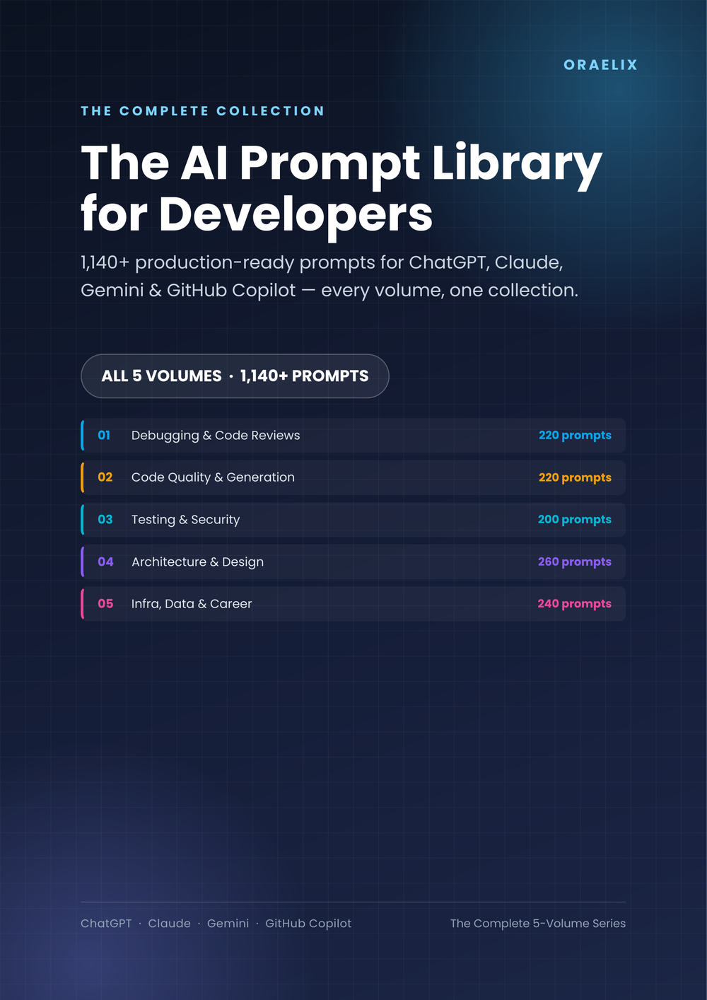

# The AI Prompt Library for Developers

**1,140+ production-ready prompts for ChatGPT, Claude, Gemini & GitHub Copilot**
*Debugging · Code Review · Refactoring · Testing · Security · Architecture · DevOps · Career*

**[📄 Free 15-page sample PDF](#-free-sample-pdf) &nbsp;·&nbsp; [🛒 Get the full collection](#-the-collection) &nbsp;·&nbsp; [👀 Browse free prompts below](#-browse-free-samples)**

---

## Why this exists

Most "1000 ChatGPT prompts" PDFs are a copy-pasted list with the language swapped. They're not built around how debugging, code review, or system design actually work — so you end up rewriting the prompt from scratch anyway.

**Every prompt in this library is a purpose-built template for one real engineering scenario** — tracing a stack trace frame-by-frame, diagnosing a race condition with a concrete interleaving example, reviewing a PR for injection vulnerabilities with severity ratings and exploit scenarios. Not "write me some code."

Every single prompt ships with the same 10 fields, so you always know exactly what you're getting:

| Field | What it gives you |
|---|---|
| **Title & ID** | What it does, at a glance, plus a lookup code |
| **When to use it** | The specific situation this prompt is built for |
| **The Prompt** | Copy-paste ready, with `[VARIABLES]` to fill in |
| **Variables** | Exactly what to customize |
| **Tips** | Small adjustments that meaningfully improve output |
| **Example input/output** | A realistic sense of what you get back |
| **Recommended AI models** | Which tool actually performs best for this task |
| **Difficulty & time saved** | Set expectations before you start |
| **Common mistakes** | What weakens the results, so you avoid it |

---

## 📄 Free Sample PDF

Not just a teaser — **10 complete, unedited prompts** (the full *Exception & Error Message Diagnosis* category from Volume 1), in the same designed, color-coded PDF format as the paid volumes.

**[⬇ Download the free 15-page sample](https://muelspire.gumroad.com/)**

---

## 📚 The Collection

<table>
<tr>
<td width="18%"></td>
<td>

### Volume 1 — Debugging & Code Reviews
**220 prompts** · 227 pages · [Free samples ↓](samples/volume-1-debugging-code-reviews.md)

Exception diagnosis, stack trace analysis, race conditions, memory leaks, flaky tests, production incident triage — plus 10 code review categories from security to legacy-code review.

**[Get Volume 1 →](https://muelspire.gumroad.com/l/debug-prompts)**

</td>
</tr>
<tr>
<td></td>
<td>

### Volume 2 — Code Quality & Generation
**220 prompts** · 230 pages · [Free samples ↓](samples/volume-2-code-quality-generation.md)

Refactoring (extract method, remove duplication, decouple tight coupling), documentation that stays useful, and code generation for CRUD endpoints, schemas, and boilerplate.

**[Get Volume 2 →](https://muelspire.gumroad.com/l/refactor-prompts)**

</td>
</tr>
<tr>
<td></td>
<td>

### Volume 3 — Testing & Security
**200 prompts** · 217 pages · [Free samples ↓](samples/volume-3-testing-security.md)

Unit through end-to-end testing, mocking strategy, contract testing between services, plus real AppSec-style security review prompts — injection, IDOR, secrets exposure, PII handling.

**[Get Volume 3 →](https://muelspire.gumroad.com/l/security-prompts)**

</td>
</tr>
<tr>
<td></td>
<td>

### Volume 4 — Architecture & Design
**260 prompts** · 285 pages · [Free samples ↓](samples/volume-4-architecture-design.md)

The biggest volume in the series. API design, system design, architecture reviews, and design patterns — built to pressure-test decisions before they're expensive to undo.

**[Get Volume 4 →](https://muelspire.gumroad.com/l/api-prompts)**

</td>
</tr>
<tr>
<td></td>
<td>

### Volume 5 — Infra, Data & Career
**240 prompts** · 263 pages · [Free samples ↓](samples/volume-5-infra-data-career.md)

SQL & databases, DevOps/CI-CD, Docker & Kubernetes, performance optimization, Git workflow, interview prep, career growth, and reusable AI workflow templates.

**[Get Volume 5 →](https://muelspire.gumroad.com/l/devops-prompts)**

</td>
</tr>
</table>

### Want all five?
**1,140+ prompts across every volume — save vs. buying separately.**

**[🛒 Get the Complete Collection →](https://muelspire.gumroad.com/l/prompt-library)**

---

## 👀 Browse Free Samples

Each volume has 3 complete, real prompts you can read right here on GitHub — no download required:

- 📁 [`samples/volume-1-debugging-code-reviews.md`](samples/volume-1-debugging-code-reviews.md)
- 📁 [`samples/volume-2-code-quality-generation.md`](samples/volume-2-code-quality-generation.md)
- 📁 [`samples/volume-3-testing-security.md`](samples/volume-3-testing-security.md)
- 📁 [`samples/volume-4-architecture-design.md`](samples/volume-4-architecture-design.md)
- 📁 [`samples/volume-5-infra-data-career.md`](samples/volume-5-infra-data-career.md)

---

## Who this is for

Software engineers, tech leads, and freelance developers who already use ChatGPT, Claude, Gemini, or GitHub Copilot daily and are tired of losing 10 minutes per prompt to trial and error. Every volume works standalone — buy exactly what you need.

## FAQ

**Do I need a specific AI tool?**
No — every prompt works in ChatGPT, Claude, Gemini, or GitHub Copilot Chat. Each one notes which model tends to perform best for that specific task.

**What format is the paid product?**
A single, designed PDF per volume — full color, dark cover, color-coded categories, and a clickable bookmark sidebar so you can jump straight to any prompt.

**Can I use the prompts commercially?**
Yes — freely, in your own personal or commercial work.

## License & Usage

The **sample prompts in this repository** (`/samples`) are free to use, share, and adapt in your own work. The **full volumes** (available via the links above) are licensed for use by the purchaser — you may use the prompts freely, but may not resell or redistribute the PDF documents themselves.

ChatGPT, Claude, Gemini, and GitHub Copilot are trademarks of their respective owners. Oraelix is not affiliated with or endorsed by OpenAI, Anthropic, Google, or GitHub/Microsoft.

---

**Built by [Oraelix](https://muelspire.gumroad.com/)** — AI-native developer tools & resources

⭐ If this was useful, a star helps other developers find it.

